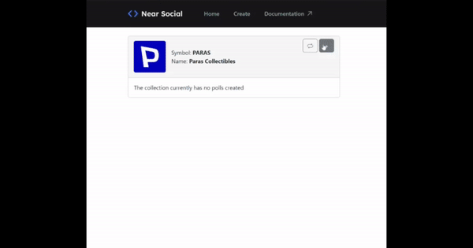
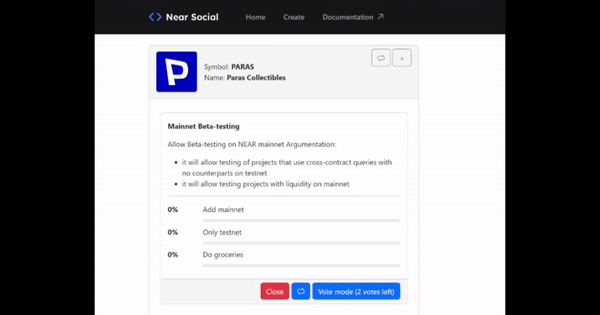

# NearSocial.NftPoll

**Solution:** A widget that allows you to conduct polls and voting for NFT owners

Our goal is to create a tool that will attr act new developers to the NEAR ecosystem. In this hackathon, we have created a voting widget that allows NFT owners to vote on proposals using TypeScript and a smart contract on the Rust NEAR SDK.

Voting widget is designed to be user-friendly and easy to use, making it accessible to both experienced developers and those new to the NEAR ecosystem. By using TypeScript and Rust, we ensure that the code is robust and secure.

### Developers can create a wide range of projects using the voting widget for NFT owners. Here are some examples:

1. **Decentralized Autonomous Organizations (DAOs)**: Developers can create DAOs where NFT owners can vote on proposals related to the governance of the organization. The voting widget can be integrated into the DAO's smart contract, ensuring that the voting process is secure and transparent.

2. **Investment Funds**: Developers can create investment funds that allow NFT owners to vote on proposals related to investment decisions. The voting widget can be used to enable NFT owners to vote on which projects to invest in, how much to invest, and other investment-related decisions.

3. **Content Platforms**: Developers can create content platforms where NFT owners can vote on proposals related to the curation of content. For example, NFT owners can vote on which artworks should be displayed on the platform or which music should be added to the platform's playlist.

4. **Gaming Communities**: Developers can create gaming communities where NFT owners can vote on proposals related to the development of the game. For example, NFT owners can vote on which new features should be added to the game or which bugs need to be fixed.

5. **Social Networks**: Developers can create social networks where NFT owners can vote on proposals related to the development of the network. For example, NFT owners can vote on which new features should be added to the network or which new communities should be created.

### Widget functionality

- Create a poll for NFT
- Selecting a list of questions
- Viewing the list of active polls
- Voting
- Viewing completed polls and their results

###  Smart contract

- Create a poll
- Record a vote and check the owner's NFT
- Get a list of completed polls

### Live code available here with NFT collection `learnernft.learnclub.near` example 

- https://near.social/#/p516entropy.near/widget/NftPoll?nftContract=learnernft.learnclub.near

### Use case flow

1. If user has at least 1 NFT of the selected collection, then user eligible to create a new poll by pressing `+` button.
   

2. User can leave as many votes as user has NFTs.
  

3. Creator of poll able to close the poll by pressing `Close` button.

### Сonclusion

Overall, the voting widget for NFT owners is a versatile tool that can be used in a wide range of projects. It allows NFT owners to participate in decision-making processes related to their investments, creating more engagement and community involvement. By leveraging the security and transparency of the Rust NEAR SDK and the flexibility of TypeScript, developers can create innovative projects that attract new users to the NEAR ecosystem.

Thank you NEAR Social for this Hackathon!
